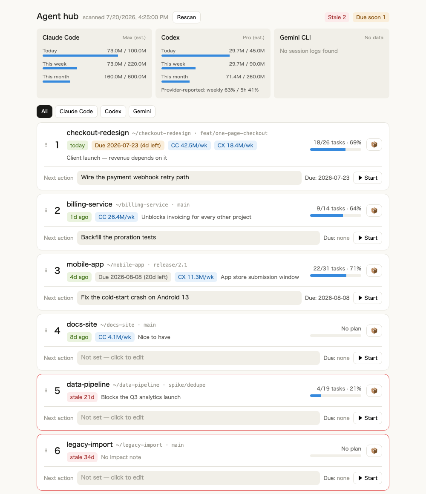

# Agent Hub

A local dashboard for deciding **which project to work on next** when you run many of them through coding agents like Claude Code and Codex.

Agent Hub is not another usage meter. Token counters tell you what you spent; they don't tell you what to do next. This tool puts the facts your disk already knows — how long each project has been untouched, how far its plan got, how many tokens each agent poured into it — next to the judgment only you can supply, and then lets you rank the list by hand.



*Demo data. Note `data-pipeline` at rank 5: labeled "Blocks the Q3 analytics launch," untouched for 21 days, zero tokens this week. That contradiction is the whole point.*

## The problem

Running five or ten projects through coding agents, you lose the thread. Which one is stalled? Which one did I claim was urgent and then not touch for three weeks? Progress data alone doesn't answer this, because priority depends on deadlines, revenue impact, and strategy that live in your head, not in the repo.

So Agent Hub does two things:

1. **Collects the facts automatically** — git activity, plan progress, and per-tool token spend, rescanned on every load so the numbers never drift from reality.
2. **Makes you externalize the judgment** — deadline, a one-line impact note, and the next action. Three fields, nothing more. Then you drag the cards into the order you actually believe in.

There is deliberately no priority score. Ranking is a value judgment, and automating it produces a number you stop trusting within a week.

## What it shows

- **Per-tool token panel** — daily, weekly, and monthly spend for Claude Code and Codex, with bars against budgets you set. Codex sessions also carry provider-reported rate-limit percentages, shown alongside the estimates.
- **Project cards in your chosen order** — last activity (red past your stale threshold), branch, plan progress, deadline countdown, per-tool tokens spent this week, and an editable next action.
- **The contradictions** — a project labeled "critical for the client demo" showing `stale 21d` and zero tokens this week is the signal the tool exists to surface.
- **Tool filter** — see only the projects a given agent actually worked on this week.

## Install

Requires Node 20+.

```bash
git clone https://github.com/<your-account>/agent-hub.git
cd agent-hub
npm install
npm run dev          # API on :5178, web on :5179
open http://localhost:5179
```

The first load parses every session log and can take a while; later loads read an incremental cache and are fast. Nothing leaves your machine — there is no network call, no telemetry, and the server binds to `127.0.0.1` only.

### Try it without touching your data

```bash
npm run demo
```

This generates a throwaway fixture in `.demo/` — six fake repos, plans, and session logs — and runs the dashboard against it. Your real projects, `~/.claude`, and `~/.codex` are never read. It's how the screenshot above was made.

### A one-word launcher

A dashboard you have to `cd` into a directory to start is a dashboard you stop opening. Symlink the launcher onto your PATH:

```bash
ln -s "$PWD/scripts/hub.sh" ~/.local/bin/hub
```

Then, from anywhere:

```bash
hub          # start if needed, open the dashboard (~1.5s cold, instant if already up)
hub demo     # same, against demo data
hub stop     # stop it
hub status   # what's running
hub log      # tail the server log
```

It runs the server detached, waits until it answers, and opens your browser. Starting when it's already running just opens the tab; switching between `hub` and `hub demo` restarts it against the other data source. The repo path is resolved from the symlink, so it works wherever you cloned to — override with `AGENT_HUB_REPO` if you need to.

## Configuration

Copy the example and edit it:

```bash
cp data/config.example.json data/config.json
```

| Field | Meaning |
|---|---|
| `scanRoots` | Directories whose immediate children are scanned for projects (a `.git` or `package.json` marks one). Defaults to `["~"]`. |
| `tools.*.limits` | Your daily/weekly/monthly token budget per tool. `null` renders a relative bar with no percentage. |
| `staleDays` | Days without a commit before a project is flagged stale. Default 14. |
| `deadlineWarnDays` | Days before a deadline turns amber. Default 14. |

Agent Hub runs fine with no config file at all — it falls back to built-in defaults.

Every source directory can also be redirected with environment variables, which is what demo mode uses: `AGENT_HUB_DATA_DIR`, `AGENT_HUB_HOME`, `AGENT_HUB_PLANS_DIR`, `AGENT_HUB_CLAUDE_DIR`, `AGENT_HUB_CODEX_DIR`. The launcher additionally reads `AGENT_HUB_REPO`, `AGENT_HUB_WEB_PORT`, and `AGENT_HUB_API_PORT`.

**About the budgets:** providers do not expose plan limits through any API, so `limits` is whatever you decide it is. The useful move is to run the tool for a week, look at your own weekly totals, and set the ceiling somewhere above your normal pace. Then the bar means "unusually heavy week," which is a signal you can act on. A number copied from a marketing page is not.

## Where the data comes from

| Source | Read from | Used for |
|---|---|---|
| Claude Code | `~/.claude/projects/**/*.jsonl` | Token spend, attributed to a project by each entry's `cwd` |
| Codex | `~/.codex/sessions/**/*.jsonl` | Token spend (deltas of the cumulative counter) and provider-reported rate limits |
| Plans | `~/.claude/plans/*.md` | Progress, from `- [x]` / `- [ ]` counts in plans that mention a project's path |
| git | each project directory | Current branch and last commit time |

All of it is read-only. The only files Agent Hub writes are its own, under `data/`.

## Your data stays yours

`data/store.json` (your rankings, deadlines, and notes), `data/config.json` (your budgets), and `data/usage-cache.json` are all gitignored. Delete the cache any time — it rebuilds from the session logs.

## Known limits

- **Gemini CLI** appears in the UI but has no usage source; it shows "No data" until one exists.
- **Log formats belong to the vendors** and can change without warning. When more than half the lines in a tool's logs fail to parse, its panel says so rather than quietly reporting zero.
- **Plan matching is heuristic.** A plan is linked to a project when it mentions that project's path. Plans without checkboxes show as "No plan."
- **Single user, local only.** No auth, no multi-user, no hosting. This is a tool you run on the machine where the agents run.

## Development

```bash
npm test             # vitest
npx tsc --noEmit     # type check
```

The parsers, aggregation, and API assembly are covered by tests; the UI is verified by hand.

Agent Hub was itself built by coding agents from a written spec: Claude wrote the design and a task-by-task implementation plan, Codex implemented it, and Claude reviewed the result and fixed what the tests missed.

## License

MIT — see [LICENSE](LICENSE).
